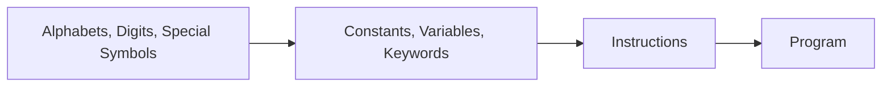

### INTRODUCTION

Four important aspects of any programming language are:
1.  The way it stores data
2.  The way it operates upon this data
3.  How it accomplishes input and output
4.  How it lets us control the sequence of execution of instructions in a program

---
### WHAT IS C?

C is a programming language developed at AT&T's Bell Laboratories of USA in 1972 by Dennis Ritchie. C became popular because it is simple and easy to use.

> An opinion that is often heard today is, "C has been already superseded by languages like C++, C#, and Java, so why bother to learn C today?"

There are several reasons for this:
* **Foundation for OOP:** Languages like C++, C#, and Java make use of a principle called Object-Oriented Programming (OOP). To use OOP effectively, you need basic programming skills. Therefore, it makes more sense to first learn C and then move on to C++, C#, or Java.
* **Operating Systems:** Major parts of popular operating systems like Windows, UNIX, Linux, and Android are written in C. Device driver programs, which allow the OS to work with new hardware, are written exclusively in C.
* **Embedded Systems:** Consumer devices like microwave ovens, washing machines, and digital cameras are getting smarter. This smartness comes from a processor and a program embedded in them. These programs have to run fast and in limited memory, making C the language of choice for building them.
* **Gaming:** The essence of many computer games is speed. To react fast to user inputs, the underlying code must be efficient. That is why popular gaming frameworks are written in C.

---
### WHICH C ARE WE LEARNING?

There have been several standards for the C language:
* **K&R C:** The original description published in 1978 by Brian Kernighan and Dennis Ritchie.
* **ANSI C / C89:** In 1983, the American National Standards Institute (ANSI) formed a committee to standardize C. This standard was completed in 1989 and is often referred to as ANSI C or C89.
* **C95:** In 1995, an extension to the C standard was published, sometimes referred to as C95.
* **C99:** In 2000, ANSI adopted the ISO C standard, which is commonly referred to as C99.

---
### STEPS IN LEARNING C LANGUAGE

The basic components of the C language are built up in a sequence, flowing from the simplest elements to a full program.

---
### ALPHABETS, DIGITS, AND SPECIAL SYMBOLS

* **Alphabets:** A, B, C, ... Z and a, b, c, ... z
* **Digits:** 0, 1, 2, ... 9
* **Special Symbols:** ~ ! @ # % ^ & * ( ) - _ + = { } [ ] | \ : ; " ' < > , . ? /

---
### CONSTANTS, VARIABLES, AND KEYWORDS

The alphabets, digits, and special symbols, when properly combined, form constants, variables, and keywords.

* A **constant** is an entity that doesn't change. Constants are also known as *literals*.
* A **variable** is an entity that may change. Variables are also known as *identifiers*.
* A **keyword** is a word that carries a special meaning to the language compiler.